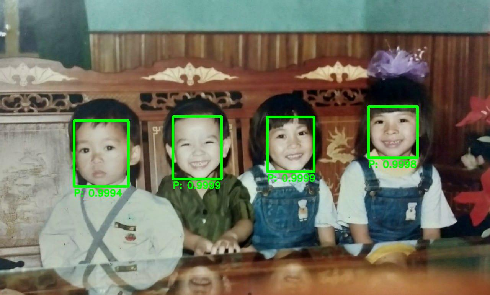

 

Create a simple face detection REST API by using technologies below

 * Pytorch
 * Django
 * Docker
 * PostgreSQL

Use pretrained model of [Pytorch_Retinaface](https://github.com/biubug6/Pytorch_Retinaface) to detect faces in picture
## Local Deploymnet
#### Contents
- [Installation](#Installation)
- [Model](#model)
- [Build](#build)
- [Run](#run)
- [Result](#result)
- [References](#references)

## Installation
#### Clone repository
 ```console
 git clone https://github.com/tonthatnam/face_detection.git
 cd face_detection
```
## Model
#### Download pretrained model
 * Download pre-traind model from Training section of [Pytorch_Retinaface](https://github.com/biubug6/Pytorch_Retinaface)
 * Organise the directory of pretrained model as follows:
```
    ./FaceDetectionAPI/api/retinaface/weights/
        mobilenet0.25_Final.pth
        mobilenetV1X0.25_pretrain.tar
        Resnet50_Final.pth
```
## Build
#### Docker build
```console
 docker-compose up -d --build
```
## Run
#### Run test on local
 To test REST API, send a post request to the end point http://localhost:8900/api/image/
## Result
#### Find faces in pictures
##### Input image


##### Output image


#### Get response
```console
{
    "status": [
        {
            "face_id": "eae0e45a-20bd-44dc-900f-c990a9f50456",
            "confidence": 0.9998941421508789,
            "bouding_box": [
                451,
                304,
                127,
                163
            ]
        },
        {
            "face_id": "9ab4c8d0-6125-4310-9700-24a85fde88a2",
            "confidence": 0.9998594522476196,
            "bouding_box": [
                698,
                305,
                122,
                143
            ]
        },
        {
            "face_id": "1b729c94-e8b3-4e3a-b40a-6b36ac41a08d",
            "confidence": 0.9998144507408142,
            "bouding_box": [
                962,
                278,
                128,
                134
            ]
        },
        {
            "face_id": "92f2694b-28ae-48e8-91aa-713dd78490b8",
            "confidence": 0.9994314312934875,
            "bouding_box": [
                193,
                315,
                142,
                172
            ]
        }
    ]
}
```
## References
#### Articles and guides that cover face_detection

 * [Build a Production Ready Face Detection API](https://medium.com/devcnairobi/build-a-production-ready-face-detection-api-part-1-c56cbe9592bf) by Urandu Bildad Namawa
 * [Dockerizing Django with Postgres, Gunicorn, and Nginx](https://testdriven.io/blog/dockerizing-django-with-postgres-gunicorn-and-nginx/#gunicorn) by Michael Herman
 * [Pytorch_Retinaface](https://github.com/biubug6/Pytorch_Retinaface) by biubug6
 * [face_recognition](https://github.com/ageitgey/face_recognition) by ageitgey
